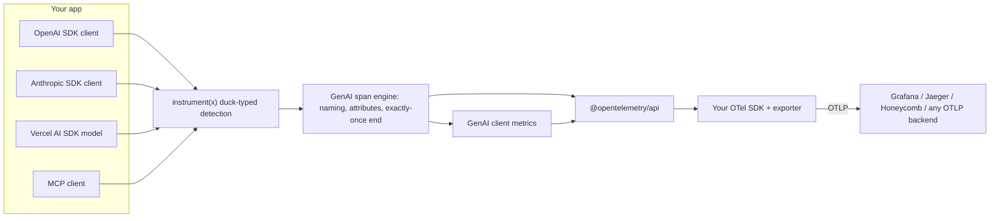

# genai-otel-ts

[English](README.md) | [中文](README.zh.md) | [日本語](README.ja.md)

[](LICENSE) [](CHANGELOG.md)  [](test/)

**TypeScript の AI SDK 呼び出しを 1 行で計装するオープンソースの OpenTelemetry ライブラリ。標準 GenAI 規約の span を出力し、ベンダーロックインがありません。**


```bash
# Not on npm yet — build from source (see Quickstart):
cd genai-otel-ts && npm install && npm run build
```

## なぜ genai-otel-ts なのか

HTTP ハンドラーもデータベースクエリもキューも、すでに OpenTelemetry でトレースされています。それなのに LLM 呼び出しだけは、可視化されないままか、独自 SDK と独自データ形式を持つベンダーの SaaS に閉じ込められています。現状の GenAI 計装エコシステムは Python が中心ですが、AI アプリの多くは TypeScript で書かれています。さらに Vercel AI SDK 内蔵のテレメトリーは独自の `ai.*` 属性スキーマで出力され、OTel GenAI セマンティック規約ではありません。`genai-otel-ts` はこのギャップを埋めます。クライアントごとに 1 行だけで、標準の `gen_ai.*` span とメトリクスを `@opentelemetry/api` 経由で既存のバックエンドに送れます。

|  | genai-otel-ts | Langfuse JS SDK | LangSmith JS SDK |
|---|---|---|---|
| テレメトリー形式 | OTel GenAI semconv (`gen_ai.*`) | Langfuse data model | LangSmith data model |
| 任意の OTLP バックエンド対応 | yes | no (Langfuse server) | no (LangSmith platform) |
| クライアントあたりの導入コスト | 1 line | SDK init + per-integration wrappers | env vars + wrappers |
| MCP client のトレース | yes | no | no |
| ランタイム依存 | `@opentelemetry/api` (peer) | `langfuse` | `langsmith` |

## 特徴

- **クライアントごとに 1 行** — `instrument(x)` が OpenAI クライアント・Anthropic クライアント・Vercel AI SDK の言語モデル・MCP クライアントを自動判別し、その場で計装します。
- **ゼロ設定** — グローバルに登録済みの OpenTelemetry SDK をそのまま使います。init 呼び出しも独自 exporter も API key も不要です。
- **標準形式のみ出力** — span 名は `chat {model}` / `embeddings {model}` / `execute_tool {tool}`、属性は `gen_ai.*` に従い、GenAI クライアントメトリクス `gen_ai.client.token.usage` と `gen_ai.client.operation.duration` も記録します。
- **streaming への正しい対応** — span はストリームが消費し切られるまで開いたままで、token 使用量と finish reason は最後のチャンクから取得します。途中の `break` やストリーム中のエラーでも span は必ず 1 回だけ閉じます。
- **コンテキスト伝播** — GenAI span はアクティブな span の子になるため、LLM 呼び出しが既存のリクエストトレースの中に現れます。
- **デフォルトでプライバシー保護** — prompt と補完の内容は、明示的にオプトインした場合のみ記録します。
- **最小の依存** — ランタイム依存は `@opentelemetry/api`（peer）だけです。各 AI SDK は構造的に判別するため、バージョンを固定しません。

## クイックスタート

1. インストール。本パッケージはまだ npm に公開されていません。リポジトリを clone してソースからビルドし、生成された tarball をアプリにインストールしてください:

```bash
git clone https://github.com/JaydenCJ/genai-otel-ts.git
cd genai-otel-ts
npm install && npm run build && npm pack   # -> genai-otel-ts-0.1.0.tgz

cd /path/to/your-app
npm install /path/to/genai-otel-ts/genai-otel-ts-0.1.0.tgz @opentelemetry/api
```

> 一般公開後は 1 コマンドになります——`npm install genai-otel-ts @opentelemetry/api`。

2. クライアントを計装します（`app.js` — 同じコードが TypeScript でも動きます）。このスニペットは ESM の `import` 構文を使うため、`package.json` に `"type": "module"` を設定してください（または拡張子を `.mjs` にして保存します）:

```ts
import { instrument } from "genai-otel-ts";
import OpenAI from "openai";

const openai = instrument(new OpenAI()); // the one line

const completion = await openai.chat.completions.create({
  model: "gpt-4o-mini",
  messages: [{ role: "user", content: "Write a haiku about tracing." }],
});
```

3. OpenTelemetry SDK が未登録の場合は、まずコンソールに span を出力してみてください（`npm install @opentelemetry/sdk-trace-node` を実行し、`otel.js` として保存）:

```js
import {
  ConsoleSpanExporter,
  NodeTracerProvider,
  SimpleSpanProcessor,
} from "@opentelemetry/sdk-trace-node";

const provider = new NodeTracerProvider({
  spanProcessors: [new SimpleSpanProcessor(new ConsoleSpanExporter())],
});
provider.register();
```

4. 実行します:

```bash
node --import ./otel.js app.js
```

出力:

```text
{
  ...
  instrumentationScope: { name: 'genai-otel-ts', version: '0.1.0', schemaUrl: undefined },
  name: 'chat gpt-4o-mini',
  kind: 2,
  attributes: {
    'gen_ai.operation.name': 'chat',
    'server.address': '127.0.0.1',
    'server.port': 4517,
    'gen_ai.provider.name': 'openai',
    'gen_ai.system': 'openai',
    'gen_ai.request.model': 'gpt-4o-mini',
    'gen_ai.response.id': 'chatcmpl-BxTZQ2n0f8Z5',
    'gen_ai.response.model': 'gpt-4o-mini-2024-07-18',
    'gen_ai.response.finish_reasons': [ 'stop' ],
    'gen_ai.usage.input_tokens': 14,
    'gen_ai.usage.output_tokens': 19
  },
  status: { code: 0 },
  ...
}
```

上記の出力は、`127.0.0.1:4517` のローカル OpenAI 互換テストサーバーに対する実際の実行結果をそのまま貼り付けたものです（API key 不要）。実際の API に向けると `server.address` は `api.openai.com` になります。本番ではコンソール exporter を OTLP exporter に差し替えるだけで、span は Grafana・Jaeger・Honeycomb・Datadog など任意の OTLP 互換バックエンドに届きます。

## 使い方

### OpenAI SDK

```ts
import { instrument } from "genai-otel-ts"; // or: instrumentOpenAI

const openai = instrument(new OpenAI());

// Chat Completions, Responses API, and Embeddings are covered —
// non-streaming and streaming alike:
const stream = await openai.chat.completions.create({
  model: "gpt-4o-mini",
  messages,
  stream: true,
  stream_options: { include_usage: true }, // usage lands on the span
});
```

OpenAI 互換バックエンド（Azure OpenAI、Groq、vLLM、Ollama など）にも対応しています。次のように正しいラベルを付けられます:

```ts
const groq = instrument(new OpenAI({ baseURL: "https://api.groq.com/openai/v1" }), {
  providerName: "groq",
});
```

### Anthropic SDK

```ts
const anthropic = instrument(new Anthropic()); // or: instrumentAnthropic

await anthropic.messages.create({ model: "claude-sonnet-4-5", max_tokens: 256, messages });

// The MessageStream helper is instrumented too:
const stream = anthropic.messages.stream({ model: "claude-sonnet-4-5", max_tokens: 256, messages });
```

### Vercel AI SDK

等価な方法が 2 つあります:

```ts
// A) wrap the model object directly — works with generateText/streamText/generateObject
import { instrument } from "genai-otel-ts";
const model = instrument(openai("gpt-4o-mini"));

// B) idiomatic AI SDK middleware
import { wrapLanguageModel } from "ai";
import { genAIMiddleware } from "genai-otel-ts";
const model = wrapLanguageModel({ model: openai("gpt-4o-mini"), middleware: genAIMiddleware() });
```

LanguageModel V1（AI SDK 3/4）と V2（AI SDK 5）の両方に対応し、usage の token フィールド名はどちらでも正規化されます。なお、AI SDK 内蔵の `experimental_telemetry` は Vercel 独自スキーマの `ai.*` 属性を出力します。`genai-otel-ts` は OTel GenAI セマンティック規約で出力するため、汎用の OTLP バックエンドが変換レイヤーなしで span を理解できます。

### MCP クライアント

```ts
const client = instrument(new Client({ name: "my-app", version: "1.0.0" }));

await client.callTool({ name: "get_weather", arguments: { city: "Tokyo" } });
// -> span `execute_tool get_weather` with gen_ai.tool.name, mcp.method.name, ...
// Tool results with isError=true are marked as span errors.
```

`readResource`・`getPrompt`・`listTools`・`listResources`・`listPrompts` にも span が生成されます。

### メッセージ内容のキャプチャ（オプトイン）

prompt と補完には機密データが含まれる可能性があるため、デフォルトでは記録しません。クライアント単位でオプトインできます:

```ts
const openai = instrument(new OpenAI(), { captureMessageContent: true });
```

または環境変数でグローバルに有効化できます（コード変更なし）:

```bash
export OTEL_INSTRUMENTATION_GENAI_CAPTURE_MESSAGE_CONTENT=true
```

内容は semconv の定める構造で `gen_ai.input.messages`・`gen_ai.output.messages`・`gen_ai.system_instructions`、および（MCP ツールでは）`gen_ai.tool.call.arguments` / `gen_ai.tool.call.result` に記録されます。

### オプション

すべてのエントリポイントが同じオプションオブジェクトを受け取ります:

| オプション | デフォルト | 説明 |
| --- | --- | --- |
| `captureMessageContent` | `false`（環境変数で上書き可） | prompt/補完の内容を span に記録します |
| `emitLegacyAttributes` | `true` | 旧バックエンド互換のため、`gen_ai.provider.name` に加えて非推奨の `gen_ai.system` も出力します |
| `recordMetrics` | `true` | `gen_ai.client.token.usage` と `gen_ai.client.operation.duration` を記録します |
| `providerName` | 自動 | `gen_ai.provider.name` を上書きします（OpenAI 互換エンドポイントでは `"groq"` など） |
| `tracer` | グローバル | グローバルの代わりに明示的な `Tracer` を指定します |

## テレメトリーリファレンス

### Span

| 呼び出し | Span 名 | 主な属性 |
| --- | --- | --- |
| OpenAI `chat.completions.create` / `responses.create` | `chat {model}` | `gen_ai.request.*`, `gen_ai.response.*`, `gen_ai.usage.*` |
| OpenAI `embeddings.create` | `embeddings {model}` | `gen_ai.request.encoding_formats`, `gen_ai.usage.input_tokens` |
| Anthropic `messages.create` / `messages.stream` | `chat {model}` | 同上 |
| AI SDK `doGenerate` / `doStream` | `chat {model}` | 同上 |
| MCP `callTool` | `execute_tool {tool}` | `gen_ai.tool.name`, `gen_ai.tool.type`, `mcp.method.name`, `mcp.tool.name` |
| MCP `readResource` / `getPrompt` / `list*` | `resources/read {uri}` など | `mcp.method.name`, `mcp.resource.uri`, `mcp.prompt.name` |

エラー時は span のステータスを `ERROR` にし、`error.type`（HTTP ステータスコードがあればそれ、なければエラークラス名）を付与し、`exception` イベントを記録します。

### メトリクス

| メトリクス | 型 | 単位 | 属性 |
| --- | --- | --- | --- |
| `gen_ai.client.token.usage` | Histogram | `{token}` | `gen_ai.token.type`（`input`/`output`）、operation、provider、リクエスト/レスポンスの model |
| `gen_ai.client.operation.duration` | Histogram | `s` | operation、provider、models、失敗時は `error.type` |

## 互換性

| インテグレーション | 対応範囲 |
| --- | --- |
| OpenAI SDK（`openai` v4/v5） | chat completions、Responses API、embeddings。streaming を含みます |
| Anthropic SDK（`@anthropic-ai/sdk`） | `messages.create`（`stream: true` を含む）、`messages.stream` |
| Vercel AI SDK（`ai` v3/v4/v5） | LanguageModel V1 と V2、generate + stream |
| MCP（`@modelcontextprotocol/sdk`） | クライアント側: tools、resources、prompts |
| Node.js | >= 18（ESM と CommonJS の両ビルドを同梱） |

既知の制限（v0.1）:

- 計装後の OpenAI/Anthropic メソッドは標準の `Promise` を返します。SDK 固有の promise 拡張（`.withResponse()` など）は計装後の呼び出しでは保持されません。
- 計装済みの OpenAI ストリームに対する `stream.tee()` はチャンク集計をバイパスします。
- ゼロコードの ESM loader hook はまだありません。下のロードマップを参照してください。

## アーキテクチャ



設計上の判断:

- **モジュールではなくインスタンスを patch します。** 手元のクライアントオブジェクトを直接計装するため、`require`/ESM loader hook を一切使わず、あらゆるバンドラーとランタイムで動きます。「目に見える 1 行」という性質も保たれ、計装が起きる場所を grep で正確に特定できます。
- **依存ではなく duck typing で判別します。** SDK は構造的に検出・消費するため、SDK のバージョンを固定せず、OpenAI 互換のサードパーティにも対応します。
- **ストリームは第一級市民です。** 単一のストリームラップ基盤（async iterable + WHATWG ReadableStream）が、4 種類の SDK それぞれ異なる streaming 形状のすべてで span の完了をちょうど 1 回に保証します。
- **セマンティック規約の変化は局所で吸収します。** GenAI 規約はまだ incubating 段階のため、属性名は 1 つのファイル（`src/semconv.ts`）に集約し、バックエンド互換のため非推奨の `gen_ai.system` エイリアスをデフォルトで出力します。

## ロードマップ

- [x] OpenAI・Anthropic・Vercel AI SDK・MCP クライアントの 1 行計装 — GenAI semconv の span とメトリクス、streaming 対応（v0.1.0）
- [ ] ゼロコード起動: `node --import genai-otel-ts/register` で標準の `OTEL_*` 環境変数から OTLP exporter を構成
- [ ] Google GenAI SDK（`@google/genai`）対応
- [ ] streaming 呼び出しの time-to-first-token 計測
- [ ] 計装後の呼び出しでも SDK の promise 拡張（OpenAI の `.withResponse()` など）を保持

全体は [open issues](https://github.com/JaydenCJ/genai-otel-ts/issues) を参照してください。

## コントリビューション

コントリビューションを歓迎します。まず [CONTRIBUTING.md](CONTRIBUTING.md) を読み、issue または pull request を立ててください。ローカル開発は `npm install && npm test` だけで完結し、ネットワークも API key も不要です。

## ライセンス

[MIT](LICENSE)
