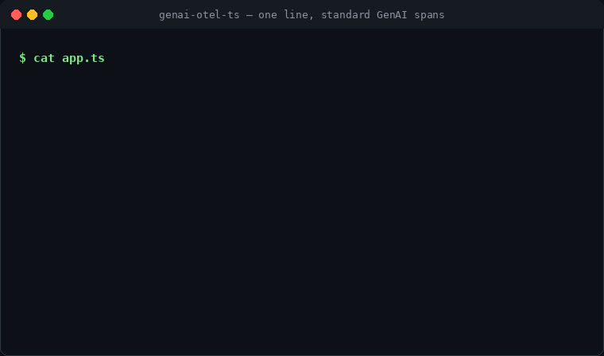
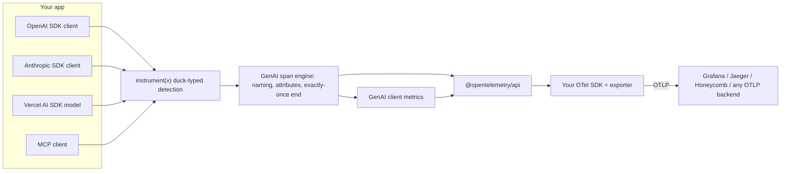

# genai-otel-ts

[English](README.md) | [中文](README.zh.md) | [日本語](README.ja.md)

[](LICENSE) [](CHANGELOG.md)  [](test/)

**Open-source, one-line OpenTelemetry instrumentation for TypeScript AI SDKs — standard GenAI spans, no vendor lock-in.**



```bash
# Not on npm yet — build from source (see Quickstart):
cd genai-otel-ts && npm install && npm run build
```

## Why genai-otel-ts?

Your HTTP handlers, database queries, and queues are already traced with OpenTelemetry — but your LLM calls are either invisible or trapped in a vendor's SaaS with its own SDK and data format. GenAI instrumentation today is Python-first, while most AI apps ship in TypeScript, and the Vercel AI SDK's built-in telemetry emits its own `ai.*` attribute schema rather than the OTel GenAI semantic conventions. `genai-otel-ts` closes that gap: one line per client, standard `gen_ai.*` spans and metrics, delivered through the `@opentelemetry/api` into whatever backend you already run.

|  | genai-otel-ts | Langfuse JS SDK | LangSmith JS SDK |
|---|---|---|---|
| Telemetry format | OTel GenAI semconv (`gen_ai.*`) | Langfuse data model | LangSmith data model |
| Works with any OTLP backend | yes | no (Langfuse server) | no (LangSmith platform) |
| Setup per client | 1 line | SDK init + per-integration wrappers | env vars + wrappers |
| MCP client tracing | yes | no | no |
| Runtime dependencies | `@opentelemetry/api` (peer) | `langfuse` | `langsmith` |

## Features

- **One line per client** — `instrument(x)` auto-detects an OpenAI client, an Anthropic client, a Vercel AI SDK language model, or an MCP client and instruments it in place.
- **Zero config** — uses the globally registered OpenTelemetry SDK; no init call, no exporter of its own, no API key.
- **Standard output only** — spans named `chat {model}` / `embeddings {model}` / `execute_tool {tool}` with `gen_ai.*` attributes, plus the GenAI client metrics `gen_ai.client.token.usage` and `gen_ai.client.operation.duration`.
- **Streaming done right** — spans stay open until the stream is consumed; token usage and finish reasons come from the final chunks, and early `break` or mid-stream errors still close the span exactly once.
- **Context propagation** — GenAI spans parent to the active span, so LLM calls appear inside your existing request traces.
- **Privacy by default** — prompt and completion content is recorded only when you opt in.
- **Tiny surface** — the sole runtime dependency is `@opentelemetry/api` (peer); the AI SDKs are detected structurally and never pinned.

## Quickstart

1. Install. The package is not published to npm yet. Clone the repository, then build the library and install the packed tarball into your app:

```bash
git clone https://github.com/JaydenCJ/genai-otel-ts.git
cd genai-otel-ts
npm install && npm run build && npm pack   # -> genai-otel-ts-0.1.0.tgz

cd /path/to/your-app
npm install /path/to/genai-otel-ts/genai-otel-ts-0.1.0.tgz @opentelemetry/api
```

> After the public release this becomes a single command — `npm install genai-otel-ts @opentelemetry/api`.

2. Instrument your client (`app.js` — same code works in TypeScript). These snippets use ESM `import` syntax, so make sure your `package.json` contains `"type": "module"` (or save the files with the `.mjs` extension instead):

```ts
import { instrument } from "genai-otel-ts";
import OpenAI from "openai";

const openai = instrument(new OpenAI()); // the one line

const completion = await openai.chat.completions.create({
  model: "gpt-4o-mini",
  messages: [{ role: "user", content: "Write a haiku about tracing." }],
});
```

3. If you have no OpenTelemetry SDK registered yet, print spans to the console (`npm install @opentelemetry/sdk-trace-node`, save as `otel.js`):

```js
import {
  ConsoleSpanExporter,
  NodeTracerProvider,
  SimpleSpanProcessor,
} from "@opentelemetry/sdk-trace-node";

const provider = new NodeTracerProvider({
  spanProcessors: [new SimpleSpanProcessor(new ConsoleSpanExporter())],
});
provider.register();
```

4. Run it:

```bash
node --import ./otel.js app.js
```

Output:

```text
{
  ...
  instrumentationScope: { name: 'genai-otel-ts', version: '0.1.0', schemaUrl: undefined },
  name: 'chat gpt-4o-mini',
  kind: 2,
  attributes: {
    'gen_ai.operation.name': 'chat',
    'server.address': '127.0.0.1',
    'server.port': 4517,
    'gen_ai.provider.name': 'openai',
    'gen_ai.system': 'openai',
    'gen_ai.request.model': 'gpt-4o-mini',
    'gen_ai.response.id': 'chatcmpl-BxTZQ2n0f8Z5',
    'gen_ai.response.model': 'gpt-4o-mini-2024-07-18',
    'gen_ai.response.finish_reasons': [ 'stop' ],
    'gen_ai.usage.input_tokens': 14,
    'gen_ai.usage.output_tokens': 19
  },
  status: { code: 0 },
  ...
}
```

The output above is copied from a real run against a local OpenAI-compatible test server on `127.0.0.1:4517` (no API key needed); pointed at the real API, `server.address` reads `api.openai.com`. In production, swap the console exporter for your OTLP exporter and the spans land in Grafana, Jaeger, Honeycomb, Datadog, or any other OTLP-compatible backend.

## Usage

### OpenAI SDK

```ts
import { instrument } from "genai-otel-ts"; // or: instrumentOpenAI

const openai = instrument(new OpenAI());

// Chat Completions, Responses API, and Embeddings are covered —
// non-streaming and streaming alike:
const stream = await openai.chat.completions.create({
  model: "gpt-4o-mini",
  messages,
  stream: true,
  stream_options: { include_usage: true }, // usage lands on the span
});
```

OpenAI-compatible backends (Azure OpenAI, Groq, vLLM, Ollama, ...) work too; label them correctly with:

```ts
const groq = instrument(new OpenAI({ baseURL: "https://api.groq.com/openai/v1" }), {
  providerName: "groq",
});
```

### Anthropic SDK

```ts
const anthropic = instrument(new Anthropic()); // or: instrumentAnthropic

await anthropic.messages.create({ model: "claude-sonnet-4-5", max_tokens: 256, messages });

// The MessageStream helper is instrumented too:
const stream = anthropic.messages.stream({ model: "claude-sonnet-4-5", max_tokens: 256, messages });
```

### Vercel AI SDK

Two equivalent options:

```ts
// A) wrap the model object directly — works with generateText/streamText/generateObject
import { instrument } from "genai-otel-ts";
const model = instrument(openai("gpt-4o-mini"));

// B) idiomatic AI SDK middleware
import { wrapLanguageModel } from "ai";
import { genAIMiddleware } from "genai-otel-ts";
const model = wrapLanguageModel({ model: openai("gpt-4o-mini"), middleware: genAIMiddleware() });
```

Both LanguageModel V1 (AI SDK 3/4) and V2 (AI SDK 5) are supported; usage token field names are normalized either way. Note that the AI SDK's built-in `experimental_telemetry` emits `ai.*` attributes in Vercel's own schema — `genai-otel-ts` emits the OTel GenAI semantic conventions instead, so generic OTLP backends understand your spans without a translation layer.

### MCP clients

```ts
const client = instrument(new Client({ name: "my-app", version: "1.0.0" }));

await client.callTool({ name: "get_weather", arguments: { city: "Tokyo" } });
// -> span `execute_tool get_weather` with gen_ai.tool.name, mcp.method.name, ...
// Tool results with isError=true are marked as span errors.
```

`readResource`, `getPrompt`, `listTools`, `listResources`, and `listPrompts` get spans as well.

### Capturing message content (opt-in)

Prompts and completions may contain sensitive data, so they are not recorded by default. Opt in per client:

```ts
const openai = instrument(new OpenAI(), { captureMessageContent: true });
```

or globally via environment variable (no code change):

```bash
export OTEL_INSTRUMENTATION_GENAI_CAPTURE_MESSAGE_CONTENT=true
```

Content is recorded in the semconv shape under `gen_ai.input.messages`, `gen_ai.output.messages`, `gen_ai.system_instructions`, and (for MCP tools) `gen_ai.tool.call.arguments` / `gen_ai.tool.call.result`.

### Options

All entry points accept the same options object:

| Option | Default | Description |
| --- | --- | --- |
| `captureMessageContent` | `false` (env-overridable) | Record prompt/completion content on spans |
| `emitLegacyAttributes` | `true` | Also emit deprecated `gen_ai.system` alongside `gen_ai.provider.name` for older backends |
| `recordMetrics` | `true` | Record `gen_ai.client.token.usage` and `gen_ai.client.operation.duration` |
| `providerName` | auto | Override `gen_ai.provider.name` (e.g. `"groq"` for OpenAI-compatible endpoints) |
| `tracer` | global | Supply an explicit `Tracer` instead of the global one |

## Telemetry reference

### Spans

| Call | Span name | Key attributes |
| --- | --- | --- |
| OpenAI `chat.completions.create` / `responses.create` | `chat {model}` | `gen_ai.request.*`, `gen_ai.response.*`, `gen_ai.usage.*` |
| OpenAI `embeddings.create` | `embeddings {model}` | `gen_ai.request.encoding_formats`, `gen_ai.usage.input_tokens` |
| Anthropic `messages.create` / `messages.stream` | `chat {model}` | same as above |
| AI SDK `doGenerate` / `doStream` | `chat {model}` | same as above |
| MCP `callTool` | `execute_tool {tool}` | `gen_ai.tool.name`, `gen_ai.tool.type`, `mcp.method.name`, `mcp.tool.name` |
| MCP `readResource` / `getPrompt` / `list*` | `resources/read {uri}`, ... | `mcp.method.name`, `mcp.resource.uri`, `mcp.prompt.name` |

Errors set span status `ERROR` plus `error.type` (HTTP status code when available, else the error class name) and record an `exception` event.

### Metrics

| Metric | Type | Unit | Attributes |
| --- | --- | --- | --- |
| `gen_ai.client.token.usage` | Histogram | `{token}` | `gen_ai.token.type` (`input`/`output`), operation, provider, request/response model |
| `gen_ai.client.operation.duration` | Histogram | `s` | operation, provider, models, `error.type` on failure |

## Compatibility

| Integration | Supported |
| --- | --- |
| OpenAI SDK (`openai` v4/v5) | chat completions, Responses API, embeddings; streaming included |
| Anthropic SDK (`@anthropic-ai/sdk`) | `messages.create` (incl. `stream: true`), `messages.stream` |
| Vercel AI SDK (`ai` v3/v4/v5) | LanguageModel V1 & V2, generate + stream |
| MCP (`@modelcontextprotocol/sdk`) | client side: tools, resources, prompts |
| Node.js | >= 18 (ESM and CommonJS builds shipped) |

Known limitations (v0.1):

- Patched OpenAI/Anthropic methods return a standard `Promise`; SDK-specific promise extensions (e.g. `.withResponse()`) are not preserved on instrumented calls.
- `stream.tee()` on an instrumented OpenAI stream bypasses chunk accounting.
- No zero-code ESM loader hook yet — see the roadmap below.

## Architecture



Design decisions:

- **Instance patching, not module patching.** Instrumenting the client object you already have avoids `require`/ESM-loader hooks entirely, works in every bundler and runtime, and keeps the "one visible line" property — you can grep for exactly where instrumentation happens.
- **Duck typing, not dependencies.** SDKs are detected and consumed structurally, so this library never pins your SDK versions and works with OpenAI-compatible third parties.
- **Streams are first-class.** A single stream-wrapping core (async iterables + WHATWG ReadableStream) guarantees exactly-once span completion across the four SDKs' different streaming shapes.
- **Semconv churn is absorbed locally.** The GenAI conventions are still incubating; attribute names live in one file (`src/semconv.ts`), and the deprecated `gen_ai.system` alias is emitted by default for backend compatibility.

## Roadmap

- [x] One-line instrumentation for OpenAI, Anthropic, Vercel AI SDK, and MCP clients — GenAI semconv spans and metrics, streaming included (v0.1.0)
- [ ] Zero-code bootstrap: `node --import genai-otel-ts/register` with an OTLP exporter configured from standard `OTEL_*` environment variables
- [ ] Google GenAI SDK (`@google/genai`) support
- [ ] Time-to-first-token measurement for streaming calls
- [ ] Preserve SDK promise extensions such as OpenAI `.withResponse()` on instrumented calls

See the [open issues](https://github.com/JaydenCJ/genai-otel-ts/issues) for the full list.

## Contributing

Contributions are welcome — read [CONTRIBUTING.md](CONTRIBUTING.md) and open an issue or pull request. Development is plain `npm install && npm test` — no network, no API keys.

## License

[MIT](LICENSE)
