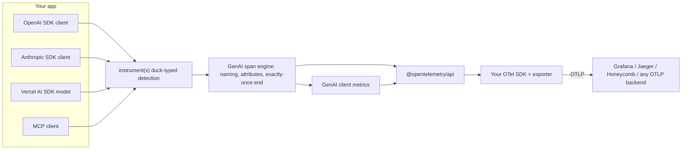

# genai-otel-ts

[English](README.md) | [中文](README.zh.md) | [日本語](README.ja.md)

[](LICENSE) [](CHANGELOG.md)  [](test/)

**面向 TypeScript AI SDK 的开源一行式 OpenTelemetry 插桩——输出标准 GenAI 语义约定 span，无厂商锁定。**


```bash
# Not on npm yet — build from source (see Quickstart):
cd genai-otel-ts && npm install && npm run build
```

## 为什么是 genai-otel-ts？

你的 HTTP 处理器、数据库查询和消息队列早已接入 OpenTelemetry——但 LLM 调用要么完全不可见，要么被困在某家厂商的 SaaS 里，用着私有 SDK 和私有数据格式。当下的 GenAI 插桩生态以 Python 为先，而大多数 AI 应用是用 TypeScript 写的；Vercel AI SDK 自带的遥测输出的是它自有的 `ai.*` 属性 schema，并非 OTel GenAI 语义约定。`genai-otel-ts` 补上这个缺口：每个客户端一行代码，输出标准 `gen_ai.*` span 与指标，经由 `@opentelemetry/api` 送进你现有的任何后端。

|  | genai-otel-ts | Langfuse JS SDK | LangSmith JS SDK |
|---|---|---|---|
| 遥测格式 | OTel GenAI semconv (`gen_ai.*`) | Langfuse data model | LangSmith data model |
| 兼容任意 OTLP 后端 | yes | no (Langfuse server) | no (LangSmith platform) |
| 单客户端接入成本 | 1 line | SDK init + per-integration wrappers | env vars + wrappers |
| MCP client 追踪 | yes | no | no |
| 运行时依赖 | `@opentelemetry/api` (peer) | `langfuse` | `langsmith` |

## 特性

- **每个客户端一行代码** —— `instrument(x)` 自动识别 OpenAI 客户端、Anthropic 客户端、Vercel AI SDK 语言模型或 MCP 客户端，并原地插桩。
- **零配置** —— 直接使用全局注册的 OpenTelemetry SDK；无需 init 调用，自身不带 exporter，也不需要 API key。
- **只输出标准格式** —— span 命名为 `chat {model}` / `embeddings {model}` / `execute_tool {tool}`，携带 `gen_ai.*` 属性，并记录 GenAI 客户端指标 `gen_ai.client.token.usage` 与 `gen_ai.client.operation.duration`。
- **流式处理做到位** —— span 在流被消费完之前保持打开；token 用量与结束原因取自最后的 chunk，提前 `break` 或流中途出错也保证 span 恰好关闭一次。
- **上下文传播** —— GenAI span 挂在当前活跃 span 之下，LLM 调用直接出现在你已有的请求 trace 里。
- **默认保护隐私** —— 只有显式开启后才记录 prompt 与补全内容。
- **极小的依赖面** —— 唯一运行时依赖是 `@opentelemetry/api`（peer）；各 AI SDK 通过结构探测识别，从不锁定版本。

## 快速开始

1. 安装。本包尚未发布到 npm。请 clone 仓库后从源码构建，并把打包出的 tarball 安装进你的应用：

```bash
git clone https://github.com/JaydenCJ/genai-otel-ts.git
cd genai-otel-ts
npm install && npm run build && npm pack   # -> genai-otel-ts-0.1.0.tgz

cd /path/to/your-app
npm install /path/to/genai-otel-ts/genai-otel-ts-0.1.0.tgz @opentelemetry/api
```

> 公开发布后，这一步会简化为一条命令——`npm install genai-otel-ts @opentelemetry/api`。

2. 插桩你的客户端（`app.js`——同样的代码在 TypeScript 中也可用）。这些代码片段使用 ESM 的 `import` 语法，请确认 `package.json` 中设置了 `"type": "module"`（或者把文件保存为 `.mjs` 扩展名）：

```ts
import { instrument } from "genai-otel-ts";
import OpenAI from "openai";

const openai = instrument(new OpenAI()); // the one line

const completion = await openai.chat.completions.create({
  model: "gpt-4o-mini",
  messages: [{ role: "user", content: "Write a haiku about tracing." }],
});
```

3. 如果你还没有注册 OpenTelemetry SDK，可以先把 span 打印到控制台（`npm install @opentelemetry/sdk-trace-node`，保存为 `otel.js`）：

```js
import {
  ConsoleSpanExporter,
  NodeTracerProvider,
  SimpleSpanProcessor,
} from "@opentelemetry/sdk-trace-node";

const provider = new NodeTracerProvider({
  spanProcessors: [new SimpleSpanProcessor(new ConsoleSpanExporter())],
});
provider.register();
```

4. 运行：

```bash
node --import ./otel.js app.js
```

输出：

```text
{
  ...
  instrumentationScope: { name: 'genai-otel-ts', version: '0.1.0', schemaUrl: undefined },
  name: 'chat gpt-4o-mini',
  kind: 2,
  attributes: {
    'gen_ai.operation.name': 'chat',
    'server.address': '127.0.0.1',
    'server.port': 4517,
    'gen_ai.provider.name': 'openai',
    'gen_ai.system': 'openai',
    'gen_ai.request.model': 'gpt-4o-mini',
    'gen_ai.response.id': 'chatcmpl-BxTZQ2n0f8Z5',
    'gen_ai.response.model': 'gpt-4o-mini-2024-07-18',
    'gen_ai.response.finish_reasons': [ 'stop' ],
    'gen_ai.usage.input_tokens': 14,
    'gen_ai.usage.output_tokens': 19
  },
  status: { code: 0 },
  ...
}
```

以上输出复制自一次真实运行：目标是 `127.0.0.1:4517` 上的本地 OpenAI 兼容测试服务器（无需 API key）；指向真实 API 时，`server.address` 会显示 `api.openai.com`。生产环境中把控制台 exporter 换成你的 OTLP exporter，span 就会落进 Grafana、Jaeger、Honeycomb、Datadog 或任何 OTLP 兼容后端。

## 使用方法

### OpenAI SDK

```ts
import { instrument } from "genai-otel-ts"; // or: instrumentOpenAI

const openai = instrument(new OpenAI());

// Chat Completions, Responses API, and Embeddings are covered —
// non-streaming and streaming alike:
const stream = await openai.chat.completions.create({
  model: "gpt-4o-mini",
  messages,
  stream: true,
  stream_options: { include_usage: true }, // usage lands on the span
});
```

OpenAI 兼容后端（Azure OpenAI、Groq、vLLM、Ollama 等）同样可用；用下面的方式给它们打上正确的标签：

```ts
const groq = instrument(new OpenAI({ baseURL: "https://api.groq.com/openai/v1" }), {
  providerName: "groq",
});
```

### Anthropic SDK

```ts
const anthropic = instrument(new Anthropic()); // or: instrumentAnthropic

await anthropic.messages.create({ model: "claude-sonnet-4-5", max_tokens: 256, messages });

// The MessageStream helper is instrumented too:
const stream = anthropic.messages.stream({ model: "claude-sonnet-4-5", max_tokens: 256, messages });
```

### Vercel AI SDK

两种等价方式：

```ts
// A) wrap the model object directly — works with generateText/streamText/generateObject
import { instrument } from "genai-otel-ts";
const model = instrument(openai("gpt-4o-mini"));

// B) idiomatic AI SDK middleware
import { wrapLanguageModel } from "ai";
import { genAIMiddleware } from "genai-otel-ts";
const model = wrapLanguageModel({ model: openai("gpt-4o-mini"), middleware: genAIMiddleware() });
```

LanguageModel V1（AI SDK 3/4）与 V2（AI SDK 5）均受支持；两种形态下的 usage token 字段名都会被归一化。注意：AI SDK 自带的 `experimental_telemetry` 输出的是 Vercel 自有 schema 的 `ai.*` 属性——`genai-otel-ts` 输出的则是 OTel GenAI 语义约定，通用 OTLP 后端无需转换层即可理解你的 span。

### MCP 客户端

```ts
const client = instrument(new Client({ name: "my-app", version: "1.0.0" }));

await client.callTool({ name: "get_weather", arguments: { city: "Tokyo" } });
// -> span `execute_tool get_weather` with gen_ai.tool.name, mcp.method.name, ...
// Tool results with isError=true are marked as span errors.
```

`readResource`、`getPrompt`、`listTools`、`listResources` 与 `listPrompts` 同样会生成 span。

### 捕获消息内容（可选开启）

prompt 与补全内容可能包含敏感数据，因此默认不记录。可按客户端开启：

```ts
const openai = instrument(new OpenAI(), { captureMessageContent: true });
```

或通过环境变量全局开启（无需改代码）：

```bash
export OTEL_INSTRUMENTATION_GENAI_CAPTURE_MESSAGE_CONTENT=true
```

内容按 semconv 规定的结构记录在 `gen_ai.input.messages`、`gen_ai.output.messages`、`gen_ai.system_instructions`，以及（MCP 工具的）`gen_ai.tool.call.arguments` / `gen_ai.tool.call.result`。

### 选项

所有入口函数接受同一个选项对象：

| 选项 | 默认值 | 说明 |
| --- | --- | --- |
| `captureMessageContent` | `false`（可用环境变量覆盖） | 在 span 上记录 prompt/补全内容 |
| `emitLegacyAttributes` | `true` | 在 `gen_ai.provider.name` 之外同时输出已废弃的 `gen_ai.system`，兼容旧后端 |
| `recordMetrics` | `true` | 记录 `gen_ai.client.token.usage` 与 `gen_ai.client.operation.duration` |
| `providerName` | 自动 | 覆盖 `gen_ai.provider.name`（如 OpenAI 兼容端点填 `"groq"`） |
| `tracer` | 全局 | 提供显式 `Tracer` 以替代全局实例 |

## 遥测参考

### Span

| 调用 | Span 名称 | 关键属性 |
| --- | --- | --- |
| OpenAI `chat.completions.create` / `responses.create` | `chat {model}` | `gen_ai.request.*`, `gen_ai.response.*`, `gen_ai.usage.*` |
| OpenAI `embeddings.create` | `embeddings {model}` | `gen_ai.request.encoding_formats`, `gen_ai.usage.input_tokens` |
| Anthropic `messages.create` / `messages.stream` | `chat {model}` | 同上 |
| AI SDK `doGenerate` / `doStream` | `chat {model}` | 同上 |
| MCP `callTool` | `execute_tool {tool}` | `gen_ai.tool.name`, `gen_ai.tool.type`, `mcp.method.name`, `mcp.tool.name` |
| MCP `readResource` / `getPrompt` / `list*` | `resources/read {uri}` 等 | `mcp.method.name`, `mcp.resource.uri`, `mcp.prompt.name` |

出错时 span 状态置为 `ERROR`，附带 `error.type`（有 HTTP 状态码时用状态码，否则用错误类名），并记录一条 `exception` 事件。

### 指标

| 指标 | 类型 | 单位 | 属性 |
| --- | --- | --- | --- |
| `gen_ai.client.token.usage` | Histogram | `{token}` | `gen_ai.token.type`（`input`/`output`）、operation、provider、请求/响应 model |
| `gen_ai.client.operation.duration` | Histogram | `s` | operation、provider、models，失败时附 `error.type` |

## 兼容性

| 集成 | 支持范围 |
| --- | --- |
| OpenAI SDK（`openai` v4/v5） | chat completions、Responses API、embeddings；含流式 |
| Anthropic SDK（`@anthropic-ai/sdk`） | `messages.create`（含 `stream: true`）、`messages.stream` |
| Vercel AI SDK（`ai` v3/v4/v5） | LanguageModel V1 与 V2，generate + stream |
| MCP（`@modelcontextprotocol/sdk`） | 客户端侧：tools、resources、prompts |
| Node.js | >= 18（同时提供 ESM 与 CommonJS 构建） |

已知限制（v0.1）：

- 被插桩的 OpenAI/Anthropic 方法返回标准 `Promise`；SDK 特有的 promise 扩展（如 `.withResponse()`）在插桩调用上不保留。
- 对已插桩的 OpenAI 流调用 `stream.tee()` 会绕过 chunk 统计。
- 尚无零代码 ESM loader hook——见下方路线图。

## 架构



设计决策：

- **实例级 patch，而非模块级 patch。** 直接对你手里的客户端对象插桩，完全避开 `require`/ESM loader hook，在任何打包器与运行时中都能工作，并保住「看得见的一行」这个特性——你可以 grep 到插桩发生的确切位置。
- **结构探测，而非依赖。** SDK 通过结构（duck typing）识别与消费，因此本库从不锁定你的 SDK 版本，也适用于 OpenAI 兼容的第三方服务。
- **流是一等公民。** 单一的流包装核心（异步可迭代对象 + WHATWG ReadableStream）保证四种 SDK 各自不同的流式形态下 span 都恰好完成一次。
- **语义约定的变动就地消化。** GenAI 约定仍处于 incubating 阶段；属性名集中在一个文件（`src/semconv.ts`），并默认输出已废弃的 `gen_ai.system` 别名以兼容既有后端。

## 路线图

- [x] OpenAI、Anthropic、Vercel AI SDK 与 MCP 客户端的一行式插桩——GenAI semconv span 与指标，含流式（v0.1.0）
- [ ] 零代码引导：`node --import genai-otel-ts/register`，从标准 `OTEL_*` 环境变量配置 OTLP exporter
- [ ] Google GenAI SDK（`@google/genai`）支持
- [ ] 流式调用的首 token 延迟（time-to-first-token）测量
- [ ] 在插桩调用上保留 SDK 的 promise 扩展（如 OpenAI `.withResponse()`）

完整列表见 [open issues](https://github.com/JaydenCJ/genai-otel-ts/issues)。

## 参与贡献

欢迎贡献——先读 [CONTRIBUTING.md](CONTRIBUTING.md)，然后提 issue 或 pull request。本地开发只需 `npm install && npm test`——不需要联网，也不需要 API key。

## 许可证

[MIT](LICENSE)
